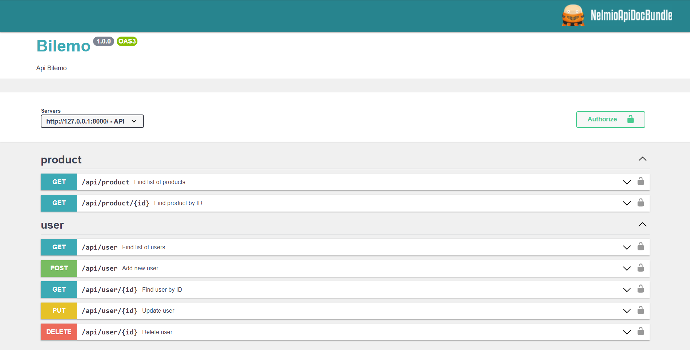

# Bilemo
Project 7 - API REST Bilemo

<h3>Documentation en ligne :</h3>

Une interface pour documenter l'API et teser les différentes méthodes a été réalisée à l'aide de NelmioApiDocBundle.

<h3>Langage de programmation</h3>

<ul>
</ul>
<li>L'API REST BileMo a été développé en PHP via le framework Symfony 6</li>
<li>L'utilisation de librairy telles que FosRestBundle, JMSSerializer et Hateoas ont été utilisées pour gérer l'ensemble des contraintes associées à la création d'une API REST.

<h2>Installation</h2>
<h3>Environnement nécessaire</h3>
<ul>
  <li>Symfony 6.0.*</li>
  <li>PHP 8.1.*</li>
</ul>
<h3>Suivre les étapes suivantes :</h3>
<ul>
  <li><b>Etape 1.1 :</b> Cloner le repository suivant depuis votre terminal :</li>
  <pre>
  <code>git clone https://github.com/sam-johnny/bilemo.git</code></pre>     
  <li>
   <li><b>Etape 1.2 :</b> Executer la commande suivante :</li>
  <pre>
  <code>composer install</code></pre>     
  <li>
    <li><b>Etape 1.3* :</b> Si besoins, ajouter le package symfony/apache-pack (en fonction de votre environnement de déploiement) :</li>
  <pre>
  <code>composer require symfony/apache-pack</code></pre>     
  <li><b>Etape 2 :</b> Editer le fichier .env </li>
    - pour renseigner vos paramètres de connexion à votre base de donnée dans la variable DATABASE_URL
  <li><b>Etape 3 :</b> Démarrer votre environnement local (Par exemple : Wamp Server)</li>
  <li><b>Etape 4 :</b> Exécuter les commandes symfony suivantes depuis votre terminal</li>
  <pre><code>
    symfony console doctrine:database:create (ou php bin/console d:d:c si vous n'avez pas installé le client symfony) 
    symfony console doctrine:migrations:migrate 
    symfony console doctrine:fixtures:load 
  </code></pre>
  <li><b>Etape 5.1 :</b> Décommenter la partie du code suivant :</li>
  <pre><code>
    // config/services.yaml
    App\EventListener\UserListener:
        tags:
            - { name: doctrine.event_listener, event: prePersist }
  </code></pre>
<li><b>Etape 5.2 :</b> Générer vos clés pour l'utilisation de JWT Token</li>
  <pre><code>
    $ mkdir -p config/jwt
    $ openssl genpkey -out config/jwt/private.pem -aes256 -algorithm rsa -pkeyopt rsa_keygen_bits:4096
    $ openssl pkey -in config/jwt/private.pem -out config/jwt/public.pem -pubout
  </code></pre>
  <li><b>Etape 5.3 :</b> Renseigner vos paramètres de configuration dans votre ficher .env</li>
  <pre><code>
    ###> lexik/jwt-authentication-bundle ###
    JWT_SECRET_KEY=%kernel.project_dir%/config/jwt/private.pem
    JWT_PUBLIC_KEY=%kernel.project_dir%/config/jwt/public.pem
    JWT_PASSPHRASE=VotrePassePhrase
    ###< lexik/jwt-authentication-bundle ###
  </code></pre>
  <li><b>Etape 5.4 :</b> Identifiant par défaut </li>
  <pre><code>
    > Login: user01
    > Password: password
</code></pre>
</ul>

<h3>Vous êtes fin prêt pour tester votre API!</h3>

Pour afficher la doucmentation en ligne et tester l'API rendez-vous à l'adresse suivante votre navigateur : <em>http://localhost/doc/api</em>
